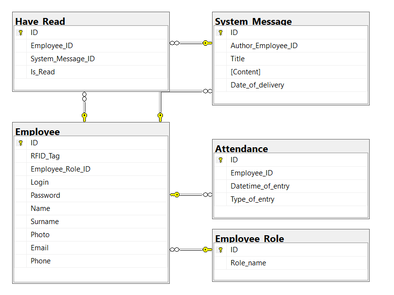

# Premium Attendance
Attendance system built in C#, uses Arduino RFID reader for recording attendance into MSSQL database. It was developed as school final project called "Omega".

## Author
- Name: Maksym Kintor
- Email: kintormaksim@gmail.com
- School: Secondary Technical School of Electrical Engineering
- Grade: C4b

## Technology used
- C# .NET
- MSSQL
- Arduino UNO & RFID reader
- Krypton Toolkit (https://github.com/ComponentFactory/Krypton)

## Table of Contents
- [Installation](#installation)
- [Run](#run)
- [Configuration](#configuration)
- [Use Case](#use-case)
- [Architecture](#architecture)
  - [User tier](#user-tier)
  - [Business tier](#business-tier)
  - [Data tier](#data-tier)
- [E-R diagram](#e-r-diagram)
- [File structure](#file-structure)
- [Errors](#errors)
- [Licence](#licence)
- [Resume](#resume)


## Installation
```bash
git clone https://github.com/MaksymDoremi/PremiumAttendance.git
```

## Run 
Windows CMD
```bash
cd PremiumAttendance/PremiumAttendance/bin/Debug/

PremiumAttendance.exe # execute exe file, or you can just click on it.
```
Git Bash
```bash
cd PremiumAttendance/PremiumAttendance/bin/Debug/

./PremiumAttendance.exe # execute exe file, or you can just click on it.
```

## Configuration

User has access to configure following variables at `PremiumAttendance/App.config`
- **remoteConnection** - remote connection to database, do not change it.
- **skolniConnection** connectionString="Data Source=**PCXXX**;Initial Catalog=Alpha_Three;Persist Security Info=True;User ID=**sa**;Password=**student**"  
Connection string to the database. Uses sa user, **You have to change PCXXX to your PC**.
- **logFilePath** value="../../../errorLogs/log.txt"  
Path where erros are logged, you can change it if you want.
Default is `PremiumAttendance/errorLogs/log.txt`.  
You can use relative path or absolute `C:/somewhere`
--

## Use Case
Default user is created in database: **Login**=admin, **Password**=123, role of the user is Administrator
- As administrator you can:
    - Edit your account
    - CRUD all employees
    - See attendance records for everyone
    - See and send notifications into system
- As employee you can:
    - Edit your account
    - Receive new notifications
    - See your attendance


## Architecture
Project is developed as three-tier application.  
Main functionality is provided by Forms, BLL(Business Logic Layer) and DAL(Data Access Layer).

Design patterns: 
- DatabaseConnection is Singleton

### User tier
- Provided by WinForms. Main forms are LoginForm and DashBoardForm.
- Admin specific forms: HomepageForm, EmployeesForm
- Employee specific forms: MyDashboardForm

### Business tier
- BusinessLogicLayer - access the DataAccessLayer

### Data tier
- DataAccessLayer - divided into 4 files: CreateDataAccessLayer, RetrieveDataAccessLayer, UpdateDataAccessLayer, DeleteDataAccessLayer
- Directly communicates with database.

## E-R diagram


## File structure
<pre>
│   PremiumAttendance.sln
│
├───PremiumAttendance
│   │   App.config
│   │   PremiumAttendance.csproj
│   │
│   │───data
│   │       rfid.ino
│   ├───doc
│   │       README.md <b>(this file)</b>
│   │
│   ├───errorLogs
│   │       log.txt
│   ├───src
│   │   │   Program.cs
│   │   │
│   │   ├───Controls
│   │   │       AttendanceFormAttendanceControl.cs
│   │   │       AttendanceFormAttendanceControl.Designer.cs
│   │   │       AttendanceFormAttendanceControl.resx
│   │   │       AttendanceFormEmployeeControl.cs
│   │   │       AttendanceFormEmployeeControl.Designer.cs
│   │   │       AttendanceFormEmployeeControl.resx
│   │   │       ColleagueControl.cs
│   │   │       ColleagueControl.Designer.cs
│   │   │       ColleagueControl.resx
│   │   │       EmployeeControl.cs
│   │   │       EmployeeControl.Designer.cs
│   │   │       EmployeeControl.resx
│   │   │       EmployeeStatusControl.cs
│   │   │       EmployeeStatusControl.Designer.cs
│   │   │       EmployeeStatusControl.resx
│   │   │       NotificationControl.cs
│   │   │       NotificationControl.Designer.cs
│   │   │       NotificationControl.resx
│   │   │
│   │   ├───DB
│   │   │       DatabaseConnection.cs
│   │   │
│   │   ├───Forms
│   │   │   │   DashBoardForm.cs
│   │   │   │   DashBoardForm.Designer.cs
│   │   │   │   DashBoardForm.resx
│   │   │   │   LoginForm.cs
│   │   │   │   LoginForm.Designer.cs
│   │   │   │   LoginForm.resx
│   │   │   │
│   │   │   ├───SidebarForms
│   │   │   │       AttendanceForm.cs
│   │   │   │       AttendanceForm.Designer.cs
│   │   │   │       AttendanceForm.resx
│   │   │   │       EmployeesForm.cs
│   │   │   │       EmployeesForm.Designer.cs
│   │   │   │       EmployeesForm.resx
│   │   │   │       HomepageForm.cs
│   │   │   │       HomepageForm.Designer.cs
│   │   │   │       HomepageForm.resx
│   │   │   │       MyAccountForm.cs
│   │   │   │       MyAccountForm.Designer.cs
│   │   │   │       MyAccountForm.resx
│   │   │   │       MyDashboardForm.cs
│   │   │   │       MyDashboardForm.Designer.cs
│   │   │   │       MyDashboardForm.resx
│   │   │   │       NotificationForm.cs
│   │   │   │       NotificationForm.Designer.cs
│   │   │   │       NotificationForm.resx
│   │   │   │
│   │   │   └───SubForms
│   │   │           AddEmployeeForm.cs
│   │   │           AddEmployeeForm.Designer.cs
│   │   │           AddEmployeeForm.resx
│   │   │           ChangePasswordForm.cs
│   │   │           ChangePasswordForm.Designer.cs
│   │   │           ChangePasswordForm.resx
│   │   │           CustomizeAccountForm.cs
│   │   │           CustomizeAccountForm.Designer.cs
│   │   │           CustomizeAccountForm.resx
│   │   │           EmployeeAccount.cs
│   │   │           EmployeeAccount.Designer.cs
│   │   │           EmployeeAccount.resx
│   │   │           NotificationDetailsForm.cs
│   │   │           NotificationDetailsForm.Designer.cs
│   │   │           NotificationDetailsForm.resx
│   │   │           SendNotificationForm.cs
│   │   │           SendNotificationForm.Designer.cs
│   │   │           SendNotificationForm.resx
│   │   │
│   │   └───objects
│   │       │   APIClient.cs
│   │       │   BusinessLogicLayer.cs
│   │       │   Employee.cs
│   │       │   Logger.cs
│   │       │   Notification.cs
│   │       │   RFID.cs
│   │       │   SvatkyAPIObject.cs
│   │       │
│   │       └───DataAccessLayer
│   │               CreateDataAccessLayer.cs
│   │               DeleteDataAccessLayer.cs
│   │               RetrieveDataAccessLayer.cs
│   │               UpdateDataAccessLayer.cs
│   │
│   └───vendor
│           ComponentFactory.Krypton.Design.dll
│           ComponentFactory.Krypton.Design.pdb
│           ComponentFactory.Krypton.Docking.dll
│           ComponentFactory.Krypton.Docking.pdb
│           ComponentFactory.Krypton.Navigator.dll
│           ComponentFactory.Krypton.Navigator.pdb
│           ComponentFactory.Krypton.Ribbon.dll
│           ComponentFactory.Krypton.Ribbon.pdb
│           ComponentFactory.Krypton.Toolkit.dll
│           ComponentFactory.Krypton.Toolkit.pdb
│           ComponentFactory.Krypton.Workspace.dll
│           ComponentFactory.Krypton.Workspace.pdb
│
└───sql
        script.sql
</pre>

## Errors
- Application handles SqlExceptions => notify user and log error, application can continue execution
- Error might occur with RFID reader: no reader at all, issue with COM port => application will try to reconnect COM port to RFID reader

## Licence
MIT License

Copyright (c) 2024 Maksym Kintor

Permission is hereby granted, free of charge, to any person obtaining a copy
of this software and associated documentation files (the "Software"), to deal
in the Software without restriction, including without limitation the rights
to use, copy, modify, merge, publish, distribute, sublicense, and/or sell
copies of the Software, and to permit persons to whom the Software is
furnished to do so, subject to the following conditions:

The above copyright notice and this permission notice shall be included in all
copies or substantial portions of the Software.

THE SOFTWARE IS PROVIDED "AS IS", WITHOUT WARRANTY OF ANY KIND, EXPRESS OR
IMPLIED, INCLUDING BUT NOT LIMITED TO THE WARRANTIES OF MERCHANTABILITY,
FITNESS FOR A PARTICULAR PURPOSE AND NONINFRINGEMENT. IN NO EVENT SHALL THE
AUTHORS OR COPYRIGHT HOLDERS BE LIABLE FOR ANY CLAIM, DAMAGES OR OTHER
LIABILITY, WHETHER IN AN ACTION OF CONTRACT, TORT OR OTHERWISE, ARISING FROM,
OUT OF OR IN CONNECTION WITH THE SOFTWARE OR THE USE OR OTHER DEALINGS IN THE
SOFTWARE.

## Resume
This project was developed as school task in order to teach students how to work on bigger solutions.  
That definitely gonna teach students to think in advance and try to design better and inteligent projects.  
This project can be used as educational content in schools.  